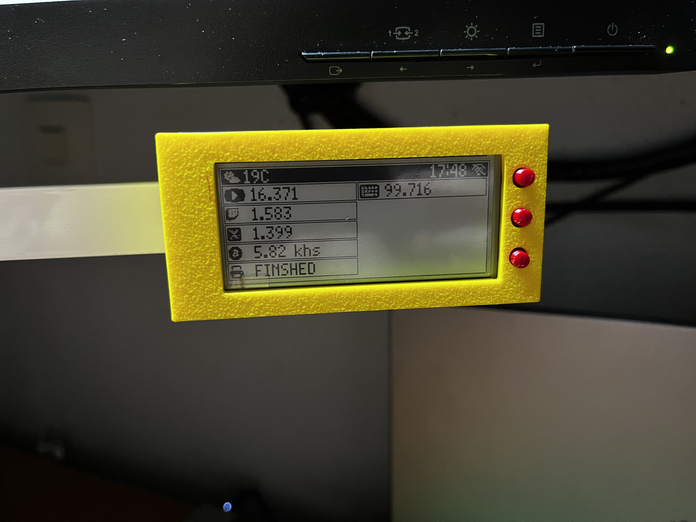
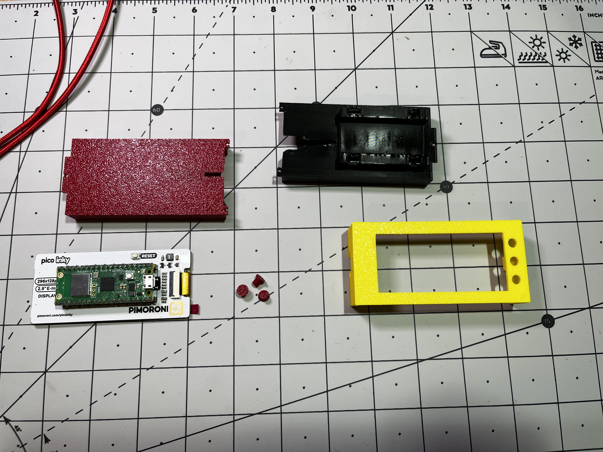
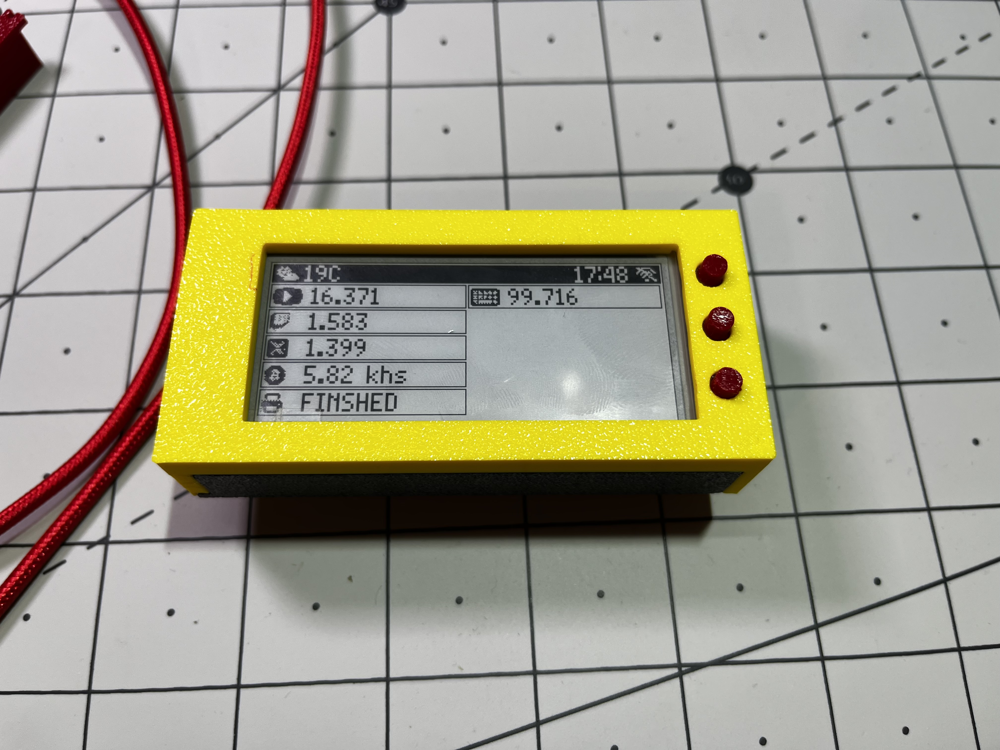

# Raspberry Pi Pico Pantalla e-paper con mis estadísticas

Pantalla para mostrar información estadística a partir de mi api utilizando un microcontrolador
raspberry pi pico con la pantalla "pico inky e-ink".

Sitio web del autor: [https://raupulus.dev](https://raupulus.dev)

En esta pantalla muestro un resumen de las pulsaciones de teclado en todos los equipos,
seguidores en redes sociales, estado de impresora 3D, velocidad de trabajo para varios mineros propios,
resumen del clima...

  
  
  

## Modelo para la caja 3D

Puedes descargar mi diseño para **pico inky e-ink screen** desde el siguiente enlace:

[https://www.thingiverse.com/thing:6640329](https://www.thingiverse.com/thing:6640329)

## Preparar proyecto

Antes de comenzar, hay que copiar el archivo **.env.example.py** a **.env.py** 
y rellenar las variables con los datos del wireless y de acceso a la API.

Una vez preparado, subir a la raspberry todo el contenido menos el directorio **docs** que es solo informativo o de imágenes.

## Instalar micropython para inky

Para poder utilizar la pantalla necesitamos instalar el firmware de micropython con soporte para esta pantalla que lo podemos encontrar en el siguiente enlace:

[https://github.com/pimoroni/pimoroni-pico/releases](https://github.com/pimoroni/pimoroni-pico/releases)

En el momento de crear el proyecto está la versión 1.21.0 (https://github.com/pimoroni/pimoroni-pico/releases/download/v1.21.0/pimoroni-inky_frame-v1.21.0-micropython.uf2)
